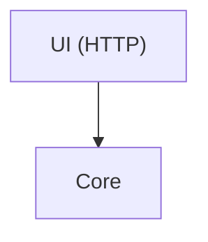

# Linee guida documentazione

Istruzioni per creare/aggiornare la documentazione di questo progetto e per replicarla su altri progetti con lo stesso stile.

---

## Stack

| Componente | Uso |
|---|---|
| [Zensical](https://zensical.org) | Static site generator (fork di MkDocs Material) |
| `zensical.toml` | Config del sito (equivalente di `mkdocs.yml`) |
| `pymdownx` | Estensioni Markdown (superfences, highlight, inlinehilite) |
| `mermaid` | Diagrammi inline nei code block `mermaid` |
| `mike` | Versioning della documentazione |

### Config di riferimento (`zensical.toml`)

Palette `indigo` light+dark, tema con `navigation.tabs`, `navigation.sections`, `navigation.expand`, `navigation.path`, azioni `content.action.edit` e `content.action.view`.

Estensioni Markdown abilitate: `abbr`, `admonition`, `attr_list`, `def_list`, `footnotes`, `md_in_html`, `tables`, `toc` (con `permalink`, `toc_depth=3`), `pymdownx.highlight` (con `anchor_linenums`, `line_spans`), `pymdownx.superfences` (custom fence `mermaid`), `pymdownx.inlinehilite`.

---

## Struttura directory

```
docs/
├── index.md                # Home — intro, stack, avvio rapido
├── architecture/           # Come è fatto il sistema
│   ├── overview.md
│   ├── <feature>-lifecycle.md
│   └── <feature>-flow.md
└── guides/                 # Cosa fare per un compito
    ├── getting-started.md
    └── adding-a-<thing>.md
```

Regola: **`architecture/` risponde a "come funziona", `guides/` risponde a "come faccio a…"**. Non mescolare.

`nav` in `zensical.toml` definisce l'ordine esplicito — non affidarsi al sort alfabetico.

---

## Convenzioni di scrittura

### Lingua
**Italiano** per tutto il corpo. Termini tecnici e identificatori di codice restano in inglese (`goroutine`, `channel`, `buffer`, nomi di funzione/tipo).

### Tono
Conciso, diretto, senza filler. Frasi brevi. Evitare "Noi", "Possiamo", "In questa sezione vedremo…". Andare dritti al punto.

### Titoli
`H1` una volta sola per pagina. Sezioni `H2`, sotto-sezioni `H3`. Non andare oltre `H3` — se serve, split in più pagine.

### Abbreviazioni
Ogni pagina dichiara in fondo le abbreviazioni usate:

```markdown
---

*[SID]: Source of Devices
*[DB]: Database
*[PK]: Primary Key
```

Separatore `---` prima del blocco. Ordine: dalla più usata alla meno usata nella pagina, oppure alfabetico. Definire **solo** gli acronimi effettivamente comparsi nella pagina.

### Admonition
Tipi usati:
- `!!! note` — informazione di contesto, principio di design
- `!!! tip` — suggerimento pratico ("primo avvio", setup veloce)
- `!!! warning` — rischio, limitazione nota, differenza rispetto a vecchi design

Sintassi:
```markdown
!!! warning "Titolo opzionale"
    Testo indentato con 4 spazi.
```

Preferire il titolo solo quando aggiunge contesto ("Drop silenzioso", "Dipendenza CGO"). Per avvisi generici usare il tipo da solo.

### Code block
Sempre con `title=`:

````markdown
```go title="manager/sid_manager.go"
func (sm *SidManager) Bootstrap() error { ... }
```
````

Evidenziare righe rilevanti con `hl_lines`:

````markdown
```go title="main.go" hl_lines="2 3"
```
````

Inline code con evidenziazione di linguaggio: `` `#!go "hanwha"` ``.

### Annotazioni numerate
Per commenti nel codice che verrebbero rumorosi, usare il pattern Material:

````markdown
```go
provider := sm.instantiate(dto) // (1)
sm.registry[dto.ID] = provider  // (2)
```

1. Crea un oggetto `SidInterface` concreto dal DTO
2. Lo aggiunge al registry in-memory — da qui in poi mai più letto dal DB
````

Utile per spiegare codice senza appesantirlo.

### Tabelle
Usare per confronti strutturati: campi, metodi di un'interfaccia, codici, stack tecnologico, struttura progetto. Header chiari, allineamento default. Evitare tabelle con una sola colonna utile.

### Definition list
Per elenchi tipo glossario/responsabilità dei componenti:

```markdown
Core
:   Punto di ingresso della logica applicativa. Orchestra i manager.
```

Preferibile alle liste puntate quando il termine e la descrizione sono entità distinte.

### Diagrammi Mermaid
Per architettura e flussi multi-componente:

````markdown

````

Per pipeline lineari (es. flusso evento → canale → DB) un blocco di testo ASCII è più chiaro di Mermaid — vedi `architecture/event-flow.md`.

---

## Pattern ricorrenti per pagina

### `index.md`
1. Titolo e tagline di una riga
2. `## Cosa fa` — bullet list
3. `## Stack` — tabella
4. `## Avvio rapido` — un solo comando
5. Admonition `tip` e `warning` su primo avvio / dipendenze di sistema

### `architecture/<feature>.md`
1. Frase intro (una riga)
2. Diagramma (Mermaid o ASCII)
3. `## Componenti` con definition list
4. `## <Principio chiave>` con admonition `note` che riassume il principio

### `architecture/<feature>-lifecycle.md`
Sezioni `## Fase 1 — <nome>`, `## Fase 2 — <nome>`. Per ogni fase: schema (SQL / Go), code snippet, annotazioni numerate se servono.

### `guides/getting-started.md`
1. Prerequisiti (definition list con comandi per OS)
2. Installazione e avvio (block monolitico)
3. Prima configurazione
4. Struttura del progetto (tabella)

### `guides/adding-a-<thing>.md`
Numerazione esplicita: `## 1. …`, `## 2. …`, `## 3. …`. Ogni passo = un file o un punto di modifica. Admonition `note` all'inizio sul "single point of change".

---

## Replicare su altri progetti

Per generare una documentazione con lo stesso stile su un progetto nuovo:

1. **Copiare `zensical.toml`** dal progetto sorgente, aggiornando `[project]` (nome, descrizione, repo URL).
2. **Mantenere le estensioni Markdown** elencate sopra — sono il minimo per replicare lo stile.
3. **Creare la struttura** `docs/index.md` + `docs/architecture/` + `docs/guides/`, con `nav` esplicito nel toml.
4. **Copiare questa cartella `.claude/`** nel nuovo progetto: le stesse convenzioni si applicheranno.
5. **Adattare le abbreviazioni** al dominio del nuovo progetto (sostituire `SID`, `PSIM`, ecc.).
6. **Verificare il build** con `zensical build` prima del commit — Mermaid e admonition falliscono silenziosamente se la config è incompleta.

### Cosa NON copiare
- Contenuto dei file `.md` (è specifico di goPSIM)
- `[project.extra.version]` con `mike` — abilitarlo solo se il progetto ha release versionate
- `edit_uri` — va puntato al repo giusto

---

## Checklist prima del commit

- [ ] Ogni acronimo usato nella pagina è definito in fondo
- [ ] Ogni code block ha un `title=`
- [ ] Le admonition usano il tipo giusto (`note` ≠ `tip` ≠ `warning`)
- [ ] La nuova pagina è aggiunta al `nav` in `zensical.toml`
- [ ] I link interni usano path relativi (`../guides/…`) non assoluti
- [ ] `zensical build` termina senza warning
