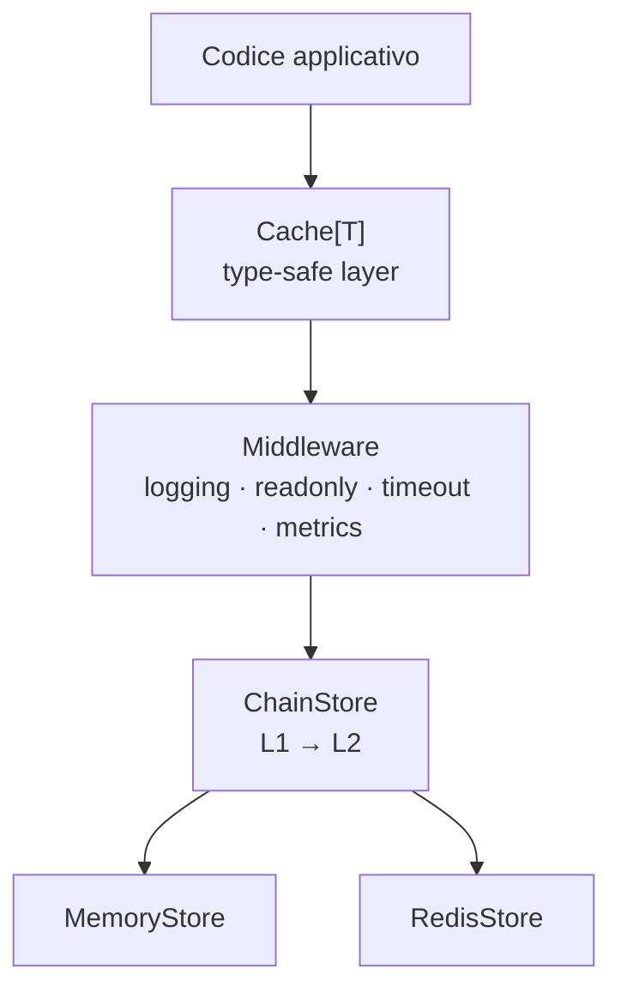

# Architettura

XCache è costruita attorno a un'idea semplice: separare la type safety dalla persistenza. Il codice applicativo lavora sempre con tipi concreti; i backend lavorano sempre con `any`. Il layer sottile che sta in mezzo — `Cache[T]` — traduce tra i due mondi senza aggiungere logica.

**`Cache[T]`** è il punto di accesso dell'applicazione. Non gestisce persistenza — avvolge uno `Store` aggiungendo esclusivamente la firma generica. Inserisci una `User`, recuperi una `User`, senza type assertion.

**`Store`** è l'interfaccia che ogni backend implementa. Lavora con `any`, è ignaro dei tipi concreti, e si occupa di lettura, scrittura e invalidazione. La stessa istanza può servire contemporaneamente una `Cache[User]` e una `Cache[Product]`.

**I middleware** decorano qualsiasi `Store` con comportamento trasversale — logging, timeout, metriche, sola lettura — senza modificare né il backend né il codice applicativo. Si compongono per annidamento: `logging.Wrap(timeout.Wrap(store, 50ms), logger)`.

**`ChainStore`** è un middleware speciale che mette in cascata più backend: in lettura scorre i tier da sinistra a destra e ripopola automaticamente quelli precedenti al hit, propagando TTL residuo e tag originali.

---

*[TTL]: Time To Live
*[L1]: Layer 1 — cache veloce in memoria
*[L2]: Layer 2 — cache distribuita
