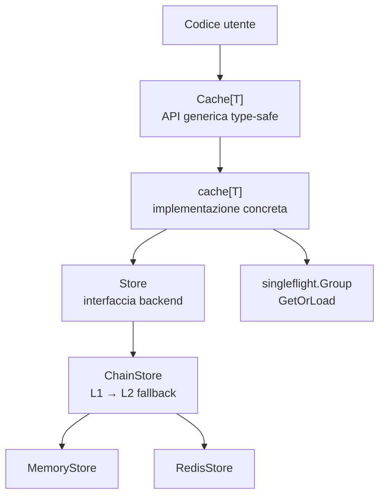

# Panoramica dell'architettura

XCache è organizzato in layer distinti con responsabilità ben separate.

## Componenti

`Store`
:   Interfaccia che ogni backend deve implementare. Lavora con `any` internamente, ignora i tipi concreti.

`Cache[T]`
:   Interfaccia generica esposta all'utente. Type-safe: nessun type assertion visibile fuori da `cache_impl.go`.

`cache[T]`
:   Implementazione concreta di `Cache[T]`. Fa da traduttore tra il mondo generico (`T`) e il mondo `any` dello `Store`. Contiene il `singleflight.Group` per `GetOrLoad`.

`ChainStore`
:   Decorator che mette in cascata più `Store`. Implementa il pattern L1→L2: se L1 manca la chiave, la cerca in L2 e la ripopola in L1.

`MemoryStore`
:   Backend in-memory con sharding, TTL passivo (al Get) e sweep attivo (goroutine background).

## Principio di separazione

!!! note "Store gestisce byte, Cache[T] gestisce tipi"
    `Store` è generico rispetto ai tipi: la stessa istanza `RedisStore` può servire sia `Cache[User]` che `Cache[Product]`. `Cache[T]` è il layer sottile che aggiunge la type-safety sopra.

---

*[L1]: Layer 1 — cache veloce in memoria
*[L2]: Layer 2 — cache distribuita (Redis)
